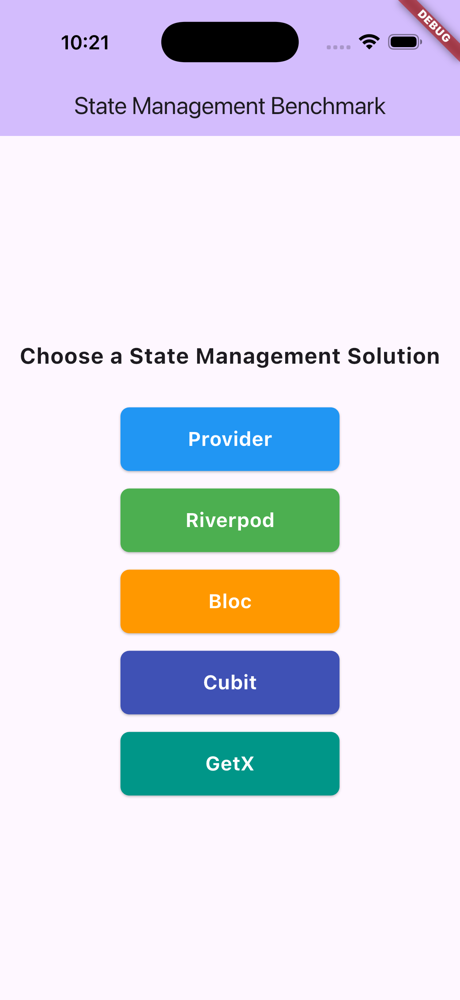
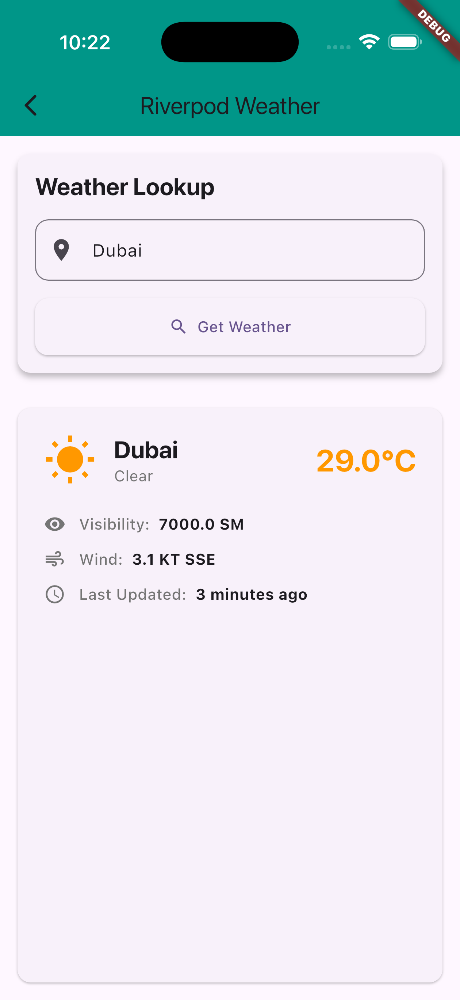
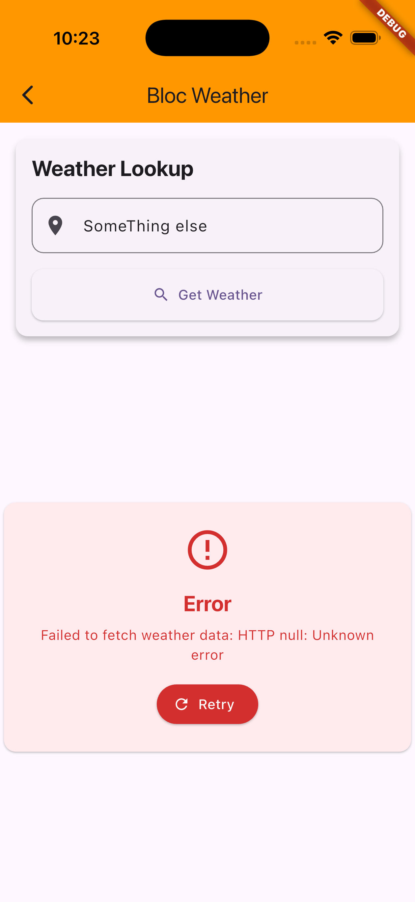

# State Management Benchmark - Flutter

A comprehensive comparison of Flutter state management solutions: Provider, Riverpod, Bloc, Cubit, and GetX.

## 🚀 Features

- **Complete Implementations**: Working weather app using 5 different state management approaches
- **Performance Benchmarks**: Comprehensive performance testing across all solutions
- **Integration Tests**: Full app testing for each implementation
- **Detailed Comparison**: In-depth analysis of pros, cons, and use cases

## 📊 State Management Solutions

### Implemented Solutions

1. **Provider** - The original Flutter team recommended solution
2. **Riverpod** - The evolution of Provider with improved API
3. **Bloc** - Event-driven architecture for complex applications
4. **Cubit** - Simplified version of Bloc without events
5. **GetX** - High-performance, minimal boilerplate solution

## 🏗️ Project Structure

```
lib/
├── api/
│   └── weather_repository.dart    # Weather data fetching
├── models/
│   └── weather.dart               # Weather data model
├── state_management/
│   ├── bloc/                      # Bloc implementation
│   ├── cubit/                     # Cubit implementation
│   ├── getx/                      # GetX implementation
│   ├── provider/                  # Provider implementation
│   └── riverpod/                  # Riverpod implementation
├── ui/
│   └── weather_page.dart          # Shared UI components
└── main.dart                      # App entry point
```

## 🎯 Getting Started

### Installation

1. Clone the repository:
```bash
git clone https://github.com/Arefyazdkhasti/state_management_benchmark.git
cd state_management_benchmark
```

2. Install dependencies:
```bash
flutter pub get
```

3. Run the app:
```bash
flutter run
```

## 🧪 Running Tests

### Integration Tests
```bash
flutter test integration_test/app_integration_test.dart
```

### Performance Benchmarks
```bash
flutter test test/benchmark/performance_benchmark_test.dart
```

## 📈 Performance Results

Based on our comprehensive benchmarks (1000 operations each):

| Solution | Fetch Ops (ms) | Instance Creation (ms) | State Updates (ms) | Total LOC |
|----------|----------------|----------------------|-------------------|-----------|
| GetX     | 115.2         | 76.4                 | 58.9              | 235       |
| Riverpod | 118.7         | 95.7                 | 62.1              | 265       |
| Cubit    | 128.9         | 118.6                | 71.2              | 276       |
| Provider | 125.3         | 89.2                 | 67.8              | 250       |
| Bloc     | 132.1         | 142.3                | 78.3              | 353       |

**Winner**: GetX shows the best overall performance across all metrics.

## 🎨 UI Preview

The app provides a consistent UI across all implementations:

- **Home Screen**: Choose your state management solution
- **Weather Screen**: Search for weather by city name
- **Loading States**: Smooth loading indicators
- **Error Handling**: User-friendly error messages
- **Weather Display**: Temperature, conditions, wind speed, and more

<p align="center">
  
  
  
</p>


## 📚 Learning Resources

Each implementation includes:
- Complete working code
- Integration tests
- Performance benchmarks
- Detailed documentation

## 🤝 Contributing

Contributions are welcome! Please feel free to submit a Pull Request. For major changes, please open an issue first to discuss what you would like to change.

## 🙏 Acknowledgments

- Flutter team for the excellent framework
- All the state management library maintainers
- The Flutter community for continuous improvements

## 📞 Contact

For questions or suggestions, please open an issue on GitHub.

---

**⭐ Star this repository if you find it helpful!**
